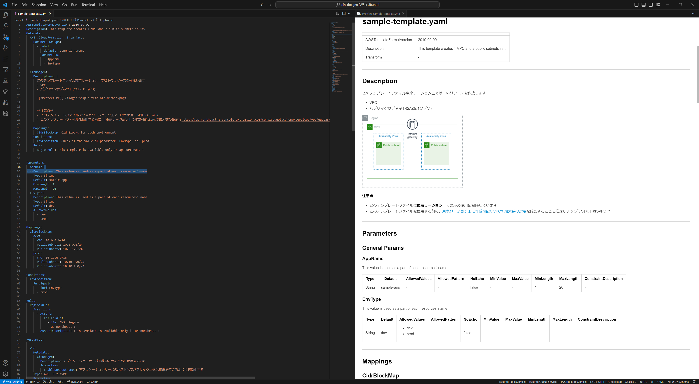

# cfn-docgen

**Generate human-readable documents from AWS CloudFormation yaml/json templates.**

<p align="left">
    <a href="https://pypi.org/project/cfn-docgen/">
        
    </a>
    <a href="https://pypi.org/project/cfn-docgen/">
        
    </a>
    <a href="https://pypi.org/project/cfn-docgen/">
        
    </a>
    <a href="https://pypi.org/project/cfn-docgen/">
        
    </a>
</p>

***We have made breaking changes from [v0.7](https://github.com/horietakehiro/cfn-docgen/tree/v0.7) to current versions.***

---

## Example

Given that you created some cfn template yaml file. When you use cfn-docgen cli. Then, you can generate markdown document. 

```Bash
$ cfn-docgen docgen \
    --format markdown \
    --source docs/sample-template.yaml \
    --dest ./docs/
[INFO] successfully generate document [./docs/sample-template.md] from template [docs/sample-template.yaml]
```

The left image is a source cfn template file and the right image is a generated document markdown.

For full example, see [docs folder](./docs/)



You can embed custom descriptions in  `Metadata` at top level and each resources like below.


## Install

### CLI

```Bash
$ pip install cfn-docgen
# you can also geenrate a document from a template at S3 bucket and upload it directory.
$ cfn-docgen \
    --source s3://bucket/templates/sample-template.yaml \
    --dest s3://bucket/documents/ \
    --format markdown
# and you can generate multiple documents from templates in direcotry(or s3 bucket prefix)
$ cfn-docgen \
    --source ./templates/ \
    --dest ./documents/ \
    --format markdown
```

---

### Docker Image

```Bash
# pull image from DockerHub
$ docker pull horietakehiro/cfn-docgen:latest

# local directory(before)
$ tree /tmp/sample/
/tmp/sample/
└── sample-template.json

0 directories, 1 files

# run as command
$ docker run \
  -v /tmp/sample/:/tmp/ \
  horietakehiro/cfn-docgen:latest docgen \
    --source /tmp/sample-template.json \
    --dest /tmp/ \
    --fmt markdown

# local directory(after)
$ tree /tmp/sample/
/tmp/sample/
├── sample-template.json
└── sample-template.md

0 directories, 2 files
```

---

### API

```python
from cfn_docgen import (
    CfnDocgenService, CfnDocgenServiceCommandInput,
    CfnTemplateSource, CfnDocumentDestination
)
service = CfnDocgenService.with_default()
service.main(
    command_input=CfnDocgenServiceCommandInput(
        template_source=CfnTemplateSource("s3://bucket/template.yaml", service.context),
        document_dest=CfnDocumentDestination("s3://bucket/document.md", service.context),
        fmt="markdown",
    )
)
```

---

### Serverless

You can also use cfn-docgen on AWS Cloud as serverless application.

You can deploy resources at [AWS Serverless Application Repository](https://ap-northeast-1.console.aws.amazon.com/lambda/home?region=ap-northeast-1#/create/app?applicationId=arn:aws:serverlessrepo:ap-northeast-1:382098889955:applications/cfn-docgen-serverless).

Once deployed, tha S3 bucket named cfn-docgen-\${AWS::AccountId}-\${AWS::Region} is created on your account.

When you upload cfn template json/yaml files at `templates/` folder of the bucket, cfn-docgen-serverless automatically will be triggered and generates markdown docments for them at `documents/` folder.

---

## Embedding Descirptions

---

### Top level descriptions

You can embed description for the template at top level `Metadata` section like this, then markdown document will be generated from it.

```Yaml
Metadata:
  CfnDocgen:
    Description: |
      このテンプレートファイル東京リージョン上で以下のリソースを作成します
      - VPC
      - パブリックサブネット(2AZに1つずつ)

      


      **注意点**
      - このテンプレートファイルは**東京リージョン**上でのみの使用に制限しています
      - このテンプレートファイルを使用する前に、[東京リージョン上に作成可能なVPCの最大数の設定](https://ap-northeast-1.console.aws.amazon.com/servicequotas/home/services/vpc/quotas/L-F678F1CE)を確認することを推奨します(デフォルトは5VPC)**
```

You can also embed descriptions for each sections - Mappings, Conditions, Rules.

```Yaml
Metadata:
  CfnDocgen:
    Mappings:
      CidrBlockMap: CidrBlocks for each environment
    Conditions:
      EnvCondition: Check if the value of parameter `EnvType` is `prod`
    Rules:
      RegionRule: This template is available only in ap-northeast-1
```

### Resources and Properties description

You can embed descriptions for resources and their properties in `Metadata` section in each resources.

```Yaml
Resources: 
  VPC:
    Metadata:
      CfnDocgen:
        Description: vpc for application to be deployed
        Properties:
          EnableDnsHostnames: application instances in public subnet have to be resolved their names from public internet.
    Type: AWS::EC2::VPC
    Properties: 
      CidrBlock: ...
```

