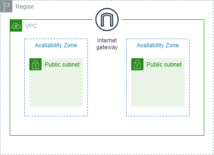

<!-- cfn-docgen: generated by v0.11.0 -->
- [sample-template.yaml](#sample-templateyaml)
  - [Description](#description)
  - [Parameters](#parameters)
    - [General Params](#general-params)
      - [AppName](#appname)
      - [EnvType](#envtype)
  - [Mappings](#mappings)
    - [CidrBlockMap](#cidrblockmap)
  - [Conditions](#conditions)
    - [EnvCondition](#envcondition)
  - [Rules](#rules)
    - [RegionRule](#regionrule)
  - [Resources](#resources)
    - [IGW (AWS::EC2::InternetGateway)](#igw-awsec2internetgateway)
    - [PublicRoute (AWS::EC2::Route)](#publicroute-awsec2route)
    - [PublicRouteTable (AWS::EC2::RouteTable)](#publicroutetable-awsec2routetable)
    - [PublicSubnet1 (AWS::EC2::Subnet)](#publicsubnet1-awsec2subnet)
    - [PublicSubnet2 (AWS::EC2::Subnet)](#publicsubnet2-awsec2subnet)
    - [PublicRtAssociation1 (AWS::EC2::SubnetRouteTableAssociation)](#publicrtassociation1-awsec2subnetroutetableassociation)
    - [PublicRtAssociation2 (AWS::EC2::SubnetRouteTableAssociation)](#publicrtassociation2-awsec2subnetroutetableassociation)
    - [VPC (AWS::EC2::VPC)](#vpc-awsec2vpc)
    - [IgwAttachment (AWS::EC2::VPCGatewayAttachment)](#igwattachment-awsec2vpcgatewayattachment)
  - [Outputs](#outputs)
    - [ProdMessage](#prodmessage)
    - [PublicSubnetId1](#publicsubnetid1)
    - [PublicSubnetId2](#publicsubnetid2)
    - [VpcId](#vpcid)

---

# sample-template.yaml

| | |
|-|-|
|AWSTemplateFormatVersion|2010-09-09|
|Description|This template creates 1 VPC and 2 public subnets in it.|
|Transform|-|

---

## Description

このテンプレートファイル東京リージョン上で以下のリソースを作成します
- VPC
- パブリックサブネット(2AZに1つずつ)

**注意点**
- このテンプレートファイルは**東京リージョン**上でのみの使用に制限しています
- このテンプレートファイルを使用する前に、[東京リージョン上に作成可能なVPCの最大数の設定](https://ap-northeast-1.console.aws.amazon.com/servicequotas/home/services/vpc/quotas/L-F678F1CE)を確認することを推奨します(デフォルトは5VPC)**

---

## Parameters

### General Params

#### AppName

This value is used as a part of each resources' name

|Type|Default|AllowedValues|AllowedPattern|NoEcho|MinValue|MaxValue|MinLength|MaxLength|ConstraintDescription|
|-|-|-|-|-|-|-|-|-|-|
|String|sample-app|-|-|false|-|-|1|20|-|

#### EnvType

This value is used as a part of each resources' name

|Type|Default|AllowedValues|AllowedPattern|NoEcho|MinValue|MaxValue|MinLength|MaxLength|ConstraintDescription|
|-|-|-|-|-|-|-|-|-|-|
|String|dev|<ul><li>dev</li><li>prod</li></ul>|-|false|-|-|-|-|-|

---

## Mappings

### CidrBlockMap

CidrBlocks for each environment

|Map|Key|Value|
|-|-|-|
|dev|PublicSubnet1|10.0.0.0/24|
|dev|PublicSubnet2|10.0.1.0/24|
|dev|VPC|10.0.0.0/16|
|prod|PublicSubnet1|10.10.0.0/24|
|prod|PublicSubnet2|10.10.1.0/24|
|prod|VPC|10.10.0.0/16|

---

## Conditions

### EnvCondition

Check if the value of parameter `EnvType` is `prod`

|Condition|
|-|
|{ &nbsp;&nbsp;"Fn::Equals":&nbsp;[ &nbsp;&nbsp;&nbsp;&nbsp;{ &nbsp;&nbsp;&nbsp;&nbsp;&nbsp;&nbsp;"Ref":&nbsp;"EnvType" &nbsp;&nbsp;&nbsp;&nbsp;}, &nbsp;&nbsp;&nbsp;&nbsp;"prod" &nbsp;&nbsp;] }|

---

## Rules

### RegionRule

This template is available only in ap-northeast-1

|RuleCondition|
|-|
|-|

|Assert|AssertDescription|
|-|-|
|{ &nbsp;&nbsp;"Fn::Equals":&nbsp;[ &nbsp;&nbsp;&nbsp;&nbsp;{ &nbsp;&nbsp;&nbsp;&nbsp;&nbsp;&nbsp;"Ref":&nbsp;"AWS::Region" &nbsp;&nbsp;&nbsp;&nbsp;}, &nbsp;&nbsp;&nbsp;&nbsp;"ap-northeast-1" &nbsp;&nbsp;] }|This template is available only in ap-northeast-1|

---

## Resources

### [IGW (AWS::EC2::InternetGateway)](http://docs.aws.amazon.com/AWSCloudFormation/latest/UserGuide/aws-resource-ec2-internetgateway.html)

|DependsOn|Condition|CreationPolicy|UpdatePolicy|UpdateReplacePolicy|DeletionPolicy|
|-|-|-|-|-|-|
|-|-|-|-|Delete|Delete|

|Property|Value|Description|Type|Required|UpdateType|
|-|-|-|-|-|-|
|Tags[0]|-|-|List of Tag|false|Mutable|
|&nbsp;&nbsp;Key|Name|-|String|true|Mutable|
|&nbsp;&nbsp;Value|{ &nbsp;&nbsp;"Fn::Sub":&nbsp;"\${AppName}-\${EnvType}-igw" }|-|String|true|Mutable|

### [PublicRoute (AWS::EC2::Route)](http://docs.aws.amazon.com/AWSCloudFormation/latest/UserGuide/aws-resource-ec2-route.html)

|DependsOn|Condition|CreationPolicy|UpdatePolicy|UpdateReplacePolicy|DeletionPolicy|
|-|-|-|-|-|-|
|-|-|-|-|Delete|Delete|

|Property|Value|Description|Type|Required|UpdateType|
|-|-|-|-|-|-|
|DestinationCidrBlock|0.0.0.0/0|-|String|false|Immutable|
|GatewayId|{ &nbsp;&nbsp;"Ref":&nbsp;"IGW" }|-|String|false|Mutable|
|RouteTableId|{ &nbsp;&nbsp;"Ref":&nbsp;"PublicRouteTable" }|-|String|true|Immutable|

### [PublicRouteTable (AWS::EC2::RouteTable)](http://docs.aws.amazon.com/AWSCloudFormation/latest/UserGuide/aws-resource-ec2-routetable.html)

パブリックサブネットからIGWへのルートを設定するためのルートテーブル

|DependsOn|Condition|CreationPolicy|UpdatePolicy|UpdateReplacePolicy|DeletionPolicy|
|-|-|-|-|-|-|
|[ &nbsp;&nbsp;"IgwAttachment" ]|-|-|-|Delete|Delete|

|Property|Value|Description|Type|Required|UpdateType|
|-|-|-|-|-|-|
|Tags[0]|-|-|List of Tag|false|Mutable|
|&nbsp;&nbsp;Key|Name|-|String|true|Mutable|
|&nbsp;&nbsp;Value|{ &nbsp;&nbsp;"Fn::Sub":&nbsp;"\${AppName}-\${EnvType}-public-rt" }|-|String|true|Mutable|
|VpcId|{ &nbsp;&nbsp;"Ref":&nbsp;"VPC" }|-|String|true|Immutable|

### [PublicSubnet1 (AWS::EC2::Subnet)](http://docs.aws.amazon.com/AWSCloudFormation/latest/UserGuide/aws-resource-ec2-subnet.html)

|DependsOn|Condition|CreationPolicy|UpdatePolicy|UpdateReplacePolicy|DeletionPolicy|
|-|-|-|-|-|-|
|-|-|-|-|Delete|Delete|

|Property|Value|Description|Type|Required|UpdateType|
|-|-|-|-|-|-|
|AvailabilityZone|{ &nbsp;&nbsp;"Fn::Select":&nbsp;[ &nbsp;&nbsp;&nbsp;&nbsp;0, &nbsp;&nbsp;&nbsp;&nbsp;{ &nbsp;&nbsp;&nbsp;&nbsp;&nbsp;&nbsp;"Fn::GetAZs":&nbsp;"" &nbsp;&nbsp;&nbsp;&nbsp;} &nbsp;&nbsp;] }|-|String|false|Immutable|
|CidrBlock|{ &nbsp;&nbsp;"Fn::FindInMap":&nbsp;[ &nbsp;&nbsp;&nbsp;&nbsp;"CidrBlockMap", &nbsp;&nbsp;&nbsp;&nbsp;{ &nbsp;&nbsp;&nbsp;&nbsp;&nbsp;&nbsp;"Ref":&nbsp;"EnvType" &nbsp;&nbsp;&nbsp;&nbsp;}, &nbsp;&nbsp;&nbsp;&nbsp;"PublicSubnet1" &nbsp;&nbsp;] }|-|String|false|Immutable|
|MapPublicIpOnLaunch|true|-|Boolean|false|Mutable|
|Tags[0]|-|-|List of Tag|false|Mutable|
|&nbsp;&nbsp;Key|Name|-|String|true|Mutable|
|&nbsp;&nbsp;Value|{ &nbsp;&nbsp;"Fn::Sub":&nbsp;"\${AppName}-\${EnvType}-public-subnet-1" }|-|String|true|Mutable|
|VpcId|{ &nbsp;&nbsp;"Ref":&nbsp;"VPC" }|-|String|true|Immutable|

### [PublicSubnet2 (AWS::EC2::Subnet)](http://docs.aws.amazon.com/AWSCloudFormation/latest/UserGuide/aws-resource-ec2-subnet.html)

|DependsOn|Condition|CreationPolicy|UpdatePolicy|UpdateReplacePolicy|DeletionPolicy|
|-|-|-|-|-|-|
|-|-|-|-|Delete|Delete|

|Property|Value|Description|Type|Required|UpdateType|
|-|-|-|-|-|-|
|AvailabilityZone|{ &nbsp;&nbsp;"Fn::Select":&nbsp;[ &nbsp;&nbsp;&nbsp;&nbsp;1, &nbsp;&nbsp;&nbsp;&nbsp;{ &nbsp;&nbsp;&nbsp;&nbsp;&nbsp;&nbsp;"Fn::GetAZs":&nbsp;"" &nbsp;&nbsp;&nbsp;&nbsp;} &nbsp;&nbsp;] }|-|String|false|Immutable|
|CidrBlock|{ &nbsp;&nbsp;"Fn::FindInMap":&nbsp;[ &nbsp;&nbsp;&nbsp;&nbsp;"CidrBlockMap", &nbsp;&nbsp;&nbsp;&nbsp;{ &nbsp;&nbsp;&nbsp;&nbsp;&nbsp;&nbsp;"Ref":&nbsp;"EnvType" &nbsp;&nbsp;&nbsp;&nbsp;}, &nbsp;&nbsp;&nbsp;&nbsp;"PublicSubnet2" &nbsp;&nbsp;] }|-|String|false|Immutable|
|MapPublicIpOnLaunch|true|-|Boolean|false|Mutable|
|Tags[0]|-|-|List of Tag|false|Mutable|
|&nbsp;&nbsp;Key|Name|-|String|true|Mutable|
|&nbsp;&nbsp;Value|{ &nbsp;&nbsp;"Fn::Sub":&nbsp;"\${AppName}-\${EnvType}-public-subnet-2" }|-|String|true|Mutable|
|VpcId|{ &nbsp;&nbsp;"Ref":&nbsp;"VPC" }|-|String|true|Immutable|

### [PublicRtAssociation1 (AWS::EC2::SubnetRouteTableAssociation)](http://docs.aws.amazon.com/AWSCloudFormation/latest/UserGuide/aws-resource-ec2-subnetroutetableassociation.html)

|DependsOn|Condition|CreationPolicy|UpdatePolicy|UpdateReplacePolicy|DeletionPolicy|
|-|-|-|-|-|-|
|-|-|-|-|Delete|Delete|

|Property|Value|Description|Type|Required|UpdateType|
|-|-|-|-|-|-|
|RouteTableId|{ &nbsp;&nbsp;"Ref":&nbsp;"PublicRouteTable" }|-|String|true|Immutable|
|SubnetId|{ &nbsp;&nbsp;"Ref":&nbsp;"PublicSubnet1" }|-|String|true|Immutable|

### [PublicRtAssociation2 (AWS::EC2::SubnetRouteTableAssociation)](http://docs.aws.amazon.com/AWSCloudFormation/latest/UserGuide/aws-resource-ec2-subnetroutetableassociation.html)

|DependsOn|Condition|CreationPolicy|UpdatePolicy|UpdateReplacePolicy|DeletionPolicy|
|-|-|-|-|-|-|
|-|-|-|-|Delete|Delete|

|Property|Value|Description|Type|Required|UpdateType|
|-|-|-|-|-|-|
|RouteTableId|{ &nbsp;&nbsp;"Ref":&nbsp;"PublicRouteTable" }|-|String|true|Immutable|
|SubnetId|{ &nbsp;&nbsp;"Ref":&nbsp;"PublicSubnet2" }|-|String|true|Immutable|

### [VPC (AWS::EC2::VPC)](http://docs.aws.amazon.com/AWSCloudFormation/latest/UserGuide/aws-resource-ec2-vpc.html)

アプリケーションサーバを稼働させるために使用するVPC

|DependsOn|Condition|CreationPolicy|UpdatePolicy|UpdateReplacePolicy|DeletionPolicy|
|-|-|-|-|-|-|
|-|-|-|-|Delete|Delete|

|Property|Value|Description|Type|Required|UpdateType|
|-|-|-|-|-|-|
|CidrBlock|{ &nbsp;&nbsp;"Fn::FindInMap":&nbsp;[ &nbsp;&nbsp;&nbsp;&nbsp;"CidrBlockMap", &nbsp;&nbsp;&nbsp;&nbsp;{ &nbsp;&nbsp;&nbsp;&nbsp;&nbsp;&nbsp;"Ref":&nbsp;"EnvType" &nbsp;&nbsp;&nbsp;&nbsp;}, &nbsp;&nbsp;&nbsp;&nbsp;"VPC" &nbsp;&nbsp;] }|-|String|false|Immutable|
|EnableDnsHostnames|true|アプリケーションサーバのホスト名でパブリックIPを名前解決できるように有効化する|Boolean|false|Mutable|
|EnableDnsSupport|true|-|Boolean|false|Mutable|
|Tags[0]|-|-|List of Tag|false|Mutable|
|&nbsp;&nbsp;Key|Name|-|String|true|Mutable|
|&nbsp;&nbsp;Value|{ &nbsp;&nbsp;"Fn::Sub":&nbsp;"\${AppName}-\${EnvType}-vpc" }|-|String|true|Mutable|

### [IgwAttachment (AWS::EC2::VPCGatewayAttachment)](http://docs.aws.amazon.com/AWSCloudFormation/latest/UserGuide/aws-resource-ec2-vpc-gateway-attachment.html)

|DependsOn|Condition|CreationPolicy|UpdatePolicy|UpdateReplacePolicy|DeletionPolicy|
|-|-|-|-|-|-|
|-|-|-|-|Delete|Delete|

|Property|Value|Description|Type|Required|UpdateType|
|-|-|-|-|-|-|
|InternetGatewayId|{ &nbsp;&nbsp;"Ref":&nbsp;"IGW" }|-|String|false|Mutable|
|VpcId|{ &nbsp;&nbsp;"Ref":&nbsp;"VPC" }|-|String|true|Mutable|

---

## Outputs

### ProdMessage

|Value|ExportName|Condition|
|-|-|-|
|This template is deployed for PROD environment|-|EnvCondition|

### PublicSubnetId1

public subnet id 1

|Value|ExportName|Condition|
|-|-|-|
|{ &nbsp;&nbsp;"Ref":&nbsp;"PublicSubnet1" }|-|-|

### PublicSubnetId2

public subnet id 2

|Value|ExportName|Condition|
|-|-|-|
|{ &nbsp;&nbsp;"Ref":&nbsp;"PublicSubnet2" }|-|-|

### VpcId

vpc id

|Value|ExportName|Condition|
|-|-|-|
|{ &nbsp;&nbsp;"Ref":&nbsp;"VPC" }|{ &nbsp;&nbsp;"Fn::Sub":&nbsp;"\${AppName}-\${EnvType}-vpc-id" }|-|